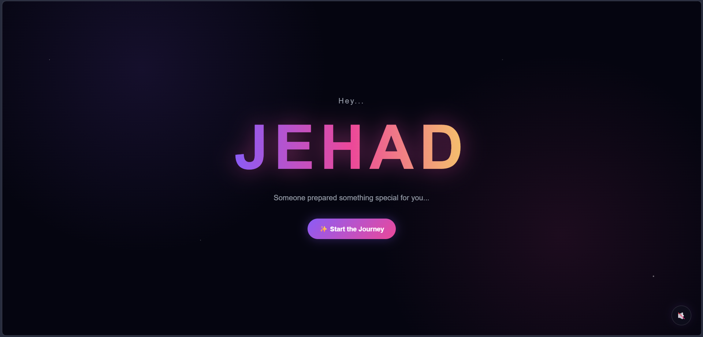
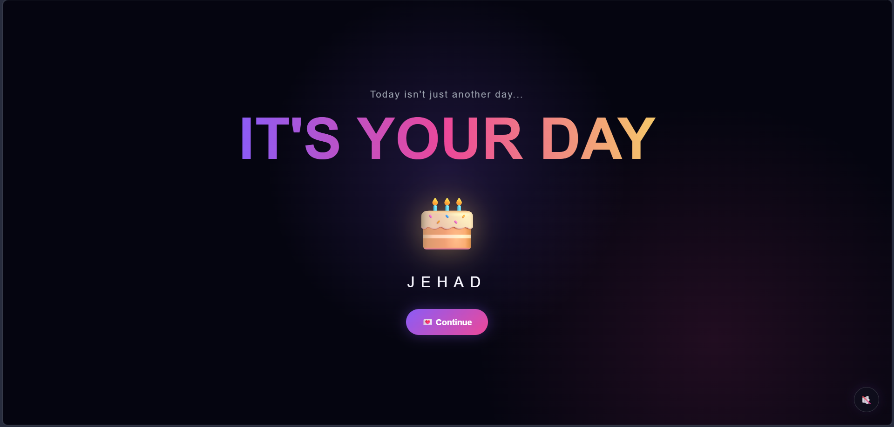
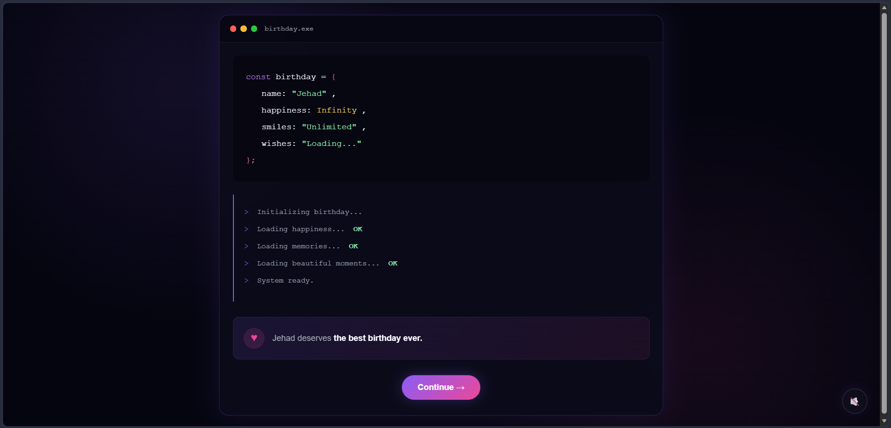
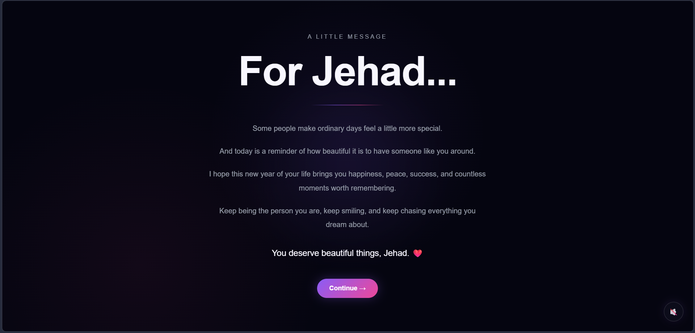
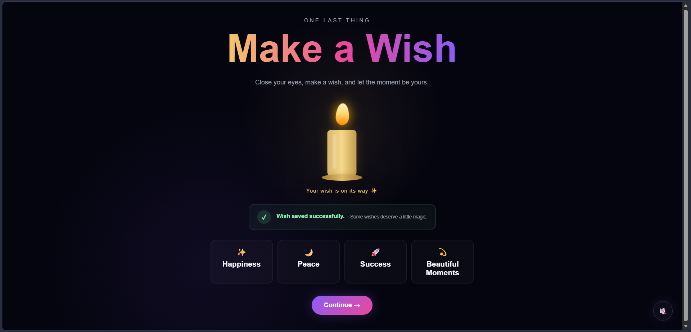
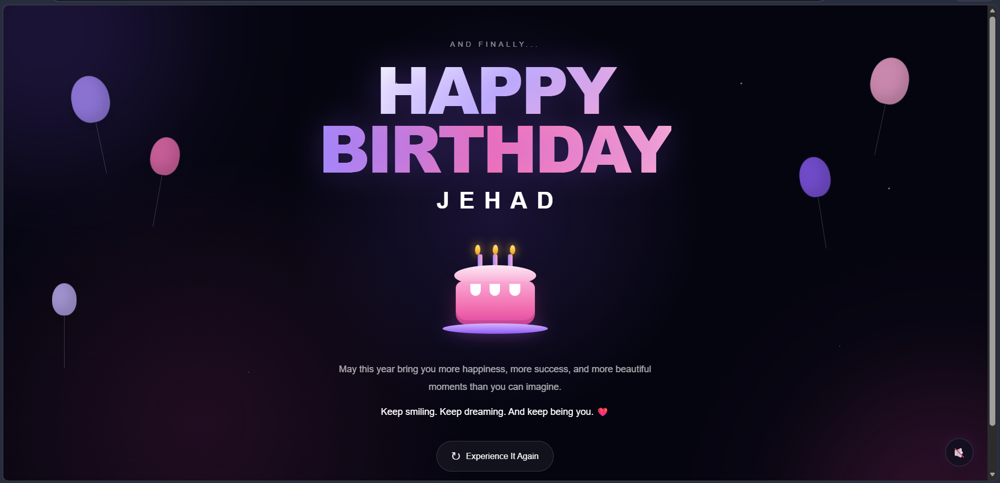

# Name Birthday Experience

> A personalized interactive birthday experience built with HTML, CSS, and JavaScript.

## Live Demo

**Live Website:**
`[https://birthday-for-gehad.vercel.app/]`

---

## Preview

### Welcome



### Celebration



### Developer Mode



### Personal Message



### Make a Wish



### Finale



---

## About The Project

**Jehad Birthday Experience** is a multi-page interactive website created as a personalized birthday surprise.

Instead of a traditional birthday message, the website takes the visitor through a small digital journey consisting of animated pages, interactive elements, personal messages, memories, music, and a final celebration.

---

## Experience Flow

```text
Welcome
   ↓
Celebration
   ↓
Developer Mode
   ↓
Personal Message
   ↓
Make a Wish
   ↓
Memories
   ↓
Finale
```

---

## Features

- Animated welcome experience
- Birthday celebration page
- Developer / terminal themed page
- Personalized birthday message
- Interactive birthday candle
- Wish interaction
- Memories gallery
- Background birthday music
- Music mute / unmute control
- Music position preserved between pages
- Unique page transitions
- Entrance and exit animations
- Animated finale with confetti
- Responsive layout
- Basic accessibility support

---

## Technologies

- HTML5
- CSS3
- JavaScript
- CSS Animations
- CSS Transitions
- LocalStorage
- Responsive Web Design

---

## Project Structure

```text
jehad-birthday/
│
├── index.html
│
├── assets/
│   ├── memories/
│   │   ├── memory-1.jpg
│   │   ├── memory-2.jpg
│   │   ├── memory-3.jpg
│   │   └── memory-4.jpg
│   │
│   └── music/
│       └── birthday.mp3
│
├── css/
│   ├── style.css
│   ├── message.css
│   ├── wish.css
│   ├── memories.css
│   └── finale.css
│
├── js/
│   ├── main.js
│   └── music.js
│
└── pages/
    ├── celebration.html
    ├── developer.html
    ├── message.html
    ├── wish.html
    ├── memories.html
    └── finale.html
```

---

## Design

The experience uses a dark, cinematic visual style with:

- Purple and pink gradients
- Glowing elements
- Animated particles and stars
- Glass-like UI elements
- Smooth transitions
- Minimal typography
- Interactive micro-animations

---

## Screenshots

Screenshots will be added here after the final version is deployed.

---

## Author

**Qusai Essam**

Frontend Developer
Mansoura University — Faculty of Computers & Information

---

## Made With

Made with code, creativity, and a lot of for Name's birthday.
